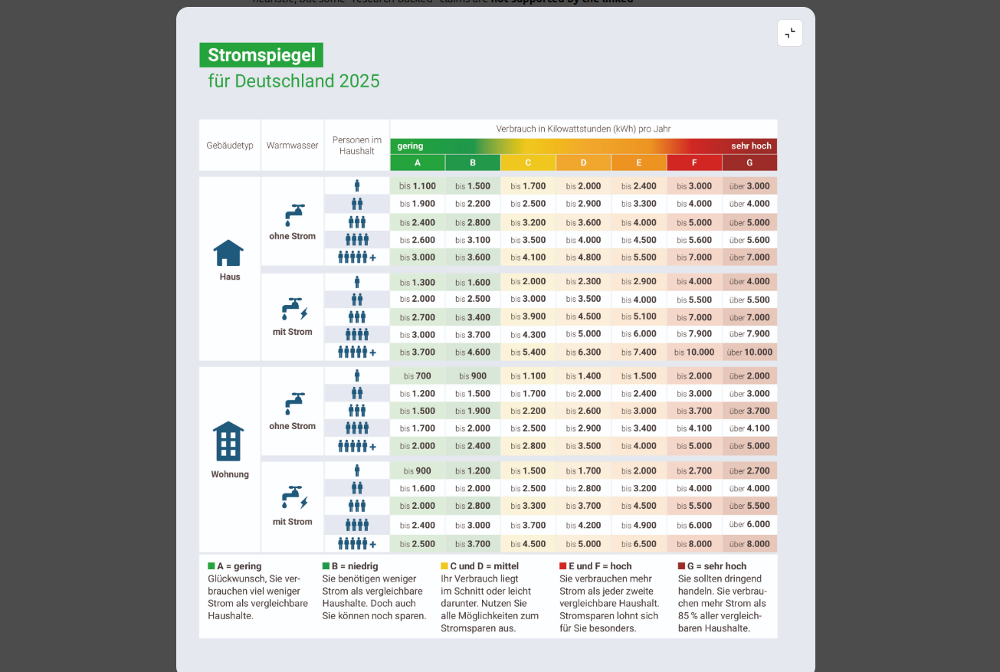

AI-Based Energy Estimation
******************************************

This section documents the current Enerplanet/PyLovo electricity estimator used
for building demand and peak load estimation.

.. contents:: Table of Contents
   :local:
   :depth: 2

Overview
========

The estimator is implemented in ``src/ai_estimation/estimator.py`` and exposed
via:

- Python helper API: ``src/ai_estimation/__init__.py``
- REST API endpoints: ``api/routers/energy.py`` (``POST /estimate-energy`` and
  ``POST /estimate-energy-batch``)

.. note::

   Despite the historical "AI estimation" naming in the docs/API, the current
   implementation is a **research-backed rule/model-based estimator**. It
   combines ``consumer_categories`` configuration, OSM ``f_class`` mappings,
   residential benchmark tables, and engineering peak-load rules.

How It Works
============

For each building, the estimator performs the following steps:

1. Normalize ``building_type`` / OSM ``f_class`` (including aliases such as
   ``flat -> apartments`` or ``townhouse -> terrace``).
2. Resolve a matching row from ``CONSUMER_CATEGORIES`` (loaded from
   ``config/config_generation.yaml``), or synthesize a fallback row from the
   inferred parent category.
3. Select one of two calculation paths:

   - ``household`` method (mainly residential buildings)
   - ``area`` method (most commercial/public/industrial/agricultural buildings)

4. Apply residential logic when applicable:

   - infer single-household vs multi-dwelling behavior from area/floors/type
   - infer or clamp household size (1..5)
   - use Stromspiegel 2025 household electricity values (house vs apartment)
   - optionally apply energy label factor (A-G)
   - optionally include electric hot water profiles
   - estimate peak load using DIN 18015 diversity and effective power tables

5. Apply age multipliers (currently active for residential annual/peak demand;
   non-residential defaults are neutral ``1.0`` in the code).
6. Return annual demand, peak load, and metadata describing which assumptions
   were applied.

See also:

- :doc:`REST API Reference <../api/index>`
- :doc:`Database Schema <../architecture/database_schema>`

Python Interface
================

Class Interface
---------------

.. code-block:: python

    from src.ai_estimation.estimator import BuildingEnergyEstimator

    estimator = BuildingEnergyEstimator()

    result = estimator.estimate(
        building_type="apartments",
        area_m2=600,
        year_of_construction=1998,
        num_floors=4,
        household_size=None,          # optional
        renovation_year=None,         # optional (Python interface only)
        energy_label="C",             # optional A-G
        hot_water_electric=False      # optional
    )

    print(result)
    # returns a dict with demand, peak, and applied assumptions

Helper Function
---------------

.. code-block:: python

    from src.ai_estimation import estimate_building_energy

    result = estimate_building_energy(
        "office",
        500,
        year=2015,
        energy_label=None,
        hot_water_electric=False,
    )

Estimator Inputs
----------------

.. list-table::
   :header-rows: 1
   :widths: 28 15 15 42

   * - Parameter
     - Type
     - Required
     - Description
   * - ``building_type``
     - str
     - Yes
     - OSM-like building type / ``f_class`` (for example ``office``, ``house``, ``apartments``)
   * - ``area_m2``
     - float
     - Yes
     - Gross floor area (minimum internally clamped to ``1.0``)
   * - ``year_of_construction``
     - int
     - No
     - Construction year for residential age multipliers
   * - ``household_size``
     - int
     - No
     - Optional residential override, normalized to ``1..5``
   * - ``num_floors``
     - int
     - No
     - Helps detect multi-dwelling residential behavior
   * - ``renovation_year``
     - int
     - No
     - Python interface only; overrides age baseline when ``>= 2002``
   * - ``energy_label``
     - str
     - No
     - Residential Stromspiegel class ``A``..``G`` (case-insensitive)
   * - ``hot_water_electric``
     - bool
     - No
     - Switches residential benchmark tables to "with electric hot water"

Estimator Output Fields
-----------------------

The estimator returns a dictionary with the following fields (exact keys from
``BuildingEnergyEstimator.estimate``):

.. list-table::
   :header-rows: 1
   :widths: 30 18 52

   * - Field
     - Type
     - Description
   * - ``yearly_demand_kwh``
     - float
     - Annual electricity demand after all applied factors
   * - ``yearly_demand_base_kwh``
     - float
     - Base annual demand used by the selected calculation path (same final value in current implementation)
   * - ``peak_load_kw``
     - float
     - Estimated operational peak load
   * - ``peak_connection_kva``
     - float / null
     - Residential connection peak derived from DIN 18015 tables (when available)
   * - ``specific_demand_kwh_m2``
     - float
     - Annual demand normalized by area
   * - ``f_class``
     - str
     - Normalized / aliased building type used for estimation
   * - ``parent_category``
     - str
     - Inferred category (for example residential/commercial/public)
   * - ``household_size_used``
     - int / null
     - Final residential household size used
   * - ``estimated_households_used``
     - float / null
     - Estimated number of dwelling units for multi-household residential buildings
   * - ``energy_label_used``
     - str / null
     - Normalized energy label (A-G)
   * - ``hot_water_electric``
     - bool
     - Echo of input flag
   * - ``age_factor_applied``
     - float
     - Annual demand age multiplier used
   * - ``age_factor_peak_applied``
     - float
     - Peak-load age multiplier used
   * - ``effective_year_used``
     - int / null
     - Construction year or renovation year used for age lookup
   * - ``source``
     - str
     - Estimator identifier (currently ``consumer_categories_fclass_model_v3``)

Calculation Formulae (Implementation-Aligned)
=============================================

This section describes the actual calculation flow implemented in
``src/ai_estimation/estimator.py`` (see ``BuildingEnergyEstimator.estimate`` and
related helper methods).

Notation
--------

.. list-table::
   :header-rows: 1
   :widths: 24 18 58

   * - Symbol
     - Unit
     - Meaning
   * - ``A``
     - m²
     - Building area (internally clamped to ``>= 1``)
   * - ``Y``
     - kWh/year
     - Annual electricity demand
   * - ``P``
     - kW
     - Operational peak load
   * - ``P_conn``
     - kVA
     - Connection peak (DIN 18015 table-based, residential)
   * - ``f_age``
     - -
     - Annual age multiplier
   * - ``f_age_peak``
     - -
     - Peak-load age multiplier
   * - ``f_label``
     - -
     - Stromspiegel energy-label factor (A-G, residential only)
   * - ``FLH``
     - h/year
     - Full-load hours fallback used for some peak calculations

1. Input Normalization and Row Resolution
-----------------------------------------

The estimator first normalizes the building type and resolves the row used for
calculation:

1. Normalize text (lowercase, remove punctuation, replace spaces/hyphens with ``_``).
2. Apply alias mapping (examples: ``flat -> apartments``, ``townhouse -> terrace``).
3. Look up the normalized type in ``CONSUMER_CATEGORIES`` (loaded from
   ``config/config_generation.yaml``).
4. If missing, infer a parent category (residential/commercial/public/etc.) and
   build a synthetic fallback row from parent templates.
5. If no template exists, use a hard fallback with ``load_method = area`` and
   ``yearly_consumption_per_m2 = 40``.

Relevant functions:

- ``_normalize()``
- ``_resolve_row()``
- ``_infer_parent_category()``
- ``_build_consumer_index()``

2. Common Pre-Calculation Steps
-------------------------------

Before branching into residential/non-residential logic:

- ``A = max(area_m2, 1.0)``
- Determine ``load_method`` from the resolved row (``household`` or ``area``)
- Compute age factors:

  - ``f_age = _get_age_multiplier(..., for_peak=False)``
  - ``f_age_peak = _get_age_multiplier(..., for_peak=True)``

- If ``renovation_year >= 2002``, it overrides construction year for age lookup.
- For non-residential buildings, current code uses neutral age factors
  (``1.0`` for annual and peak).

Relevant functions:

- ``estimate()``
- ``_get_age_multiplier()``
- ``_year_to_age_key()``

3. Residential Path (``load_method == household``)
--------------------------------------------------

The residential branch uses Stromspiegel 2025 household benchmarks and DIN 18015
peak sizing rules.

3.1 Single-Household vs Multi-Dwelling Decision
^^^^^^^^^^^^^^^^^^^^^^^^^^^^^^^^^^^^^^^^^^^^^^^^

The estimator decides whether to model a residential building as a single
household or multiple dwelling units:

- Apartment-like classes (for example ``apartments``) are always multi-dwelling.
- House-like classes become multi-dwelling if any of the following is true:

  - total area ``>= 300 m²``
  - for ``floors >= 2``:

    - per-floor area ``>= 35 m²``, and
    - total area exceeds a single-family reference area for the household size
      (or a conservative fallback reference if household size is unknown)

Relevant function:

- ``_is_multi_household_residential()``

3.2 Household Size Estimation / Override
^^^^^^^^^^^^^^^^^^^^^^^^^^^^^^^^^^^^^^^^^

- If ``household_size`` is provided, it is normalized and clamped to ``1..5``.
- Otherwise, household size is inferred from area thresholds.
- For multi-dwelling cases, the estimator uses ``per_floor_area`` as a proxy for
  apartment size when inferring occupants per dwelling.

Relevant functions:

- ``_normalize_household_size()``
- ``_estimate_residential_household_size()``
- ``_normalize_num_floors()``

3.3 Single-Household Residential Formula (house-like)
^^^^^^^^^^^^^^^^^^^^^^^^^^^^^^^^^^^^^^^^^^^^^^^^^^^^^^

For single-household residential buildings, annual demand and peak are scaled
from Stromspiegel household values using bounded power-law area factors.

Definitions:

- ``Y_household`` = Stromspiegel household annual demand (house table, by household size)
- ``A_ref`` = reference area for the same household size (house reference table)
- ``r = A / A_ref``
- ``f_area = clamp(r^0.15, 0.70, 1.35)``
- ``f_area_peak = clamp(r^0.10, 0.85, 1.25)``
- ``f_hh_peak`` = household peak factor by household size (0.80 .. 1.30)
- ``P_base`` = base peak load from row ``peak_load`` or default residential base (2.5 kW)

Calculation:

.. code-block:: text

    Y_base = Y_household * f_area * f_age
    P      = P_base * f_hh_peak * f_area_peak * f_age_peak
    P_conn = DIN_PSEFF(1, with_ewh=hot_water_electric)

Then apply energy label factor (if A/B/C/E/F/G is provided):

.. code-block:: text

    Y_base = Y_base * f_label
    P      = P * f_label

Relevant functions:

- ``_bounded_power_scale()``
- ``_energy_label_factor()``
- ``_din_pseff_kva()``

3.4 Multi-Dwelling Residential Formula (apartment-like or large house-like)
^^^^^^^^^^^^^^^^^^^^^^^^^^^^^^^^^^^^^^^^^^^^^^^^^^^^^^^^^^^^^^^^^^^^^^^^^^^^^^

For multi-dwelling residential buildings, the estimator estimates the number of
dwelling units from area and reference apartment sizes.

Definitions:

- ``Y_unit`` = Stromspiegel apartment annual demand (by household size)
- ``A_ref_unit`` = reference apartment area for inferred apartment household size
- ``n_units_raw = A / A_ref_unit``
- ``n_units = clamp(n_units_raw, 1, 80)``
- If house-like multi-dwelling: ``n_units = max(n_units, 2)``
- If ``floors >= 2``: ``n_units = max(n_units, floors)``
- ``f_hh_peak`` = household peak factor by household size
- ``g(N) = 1`` for ``N <= 1``, else ``N^(-0.45)`` (DIN-based coincidence approximation)

Calculation:

.. code-block:: text

    Y_base = Y_unit * n_units * f_age
    P      = P_base * f_hh_peak * n_units * g(n_units) * f_age_peak
           = P_base * f_hh_peak * n_units^0.55 * f_age_peak    (for n_units > 1)
    P_conn = DIN_PSEFF(n_units, with_ewh=hot_water_electric)

Then apply energy label factor (same as single-household):

.. code-block:: text

    Y_base = Y_base * f_label
    P      = P * f_label

Important implementation details:

- ``DIN_PSEFF`` is table-based with interpolation between DIN support points.
- Above the last table point (100 dwellings), a linear tail is used:

  - ``+0.2 kVA`` per dwelling (without electric hot water)
  - ``+0.4 kVA`` per dwelling (with electric hot water)

Relevant functions:

- ``_din18015_coincidence_factor()``
- ``_din_pseff_kva()``

3.5 Energy Label Factor (Stromspiegel A-G)
^^^^^^^^^^^^^^^^^^^^^^^^^^^^^^^^^^^^^^^^^^^

The energy label factor scales residential annual demand and operational peak
relative to Stromspiegel D-class.

Accepted values and behavior:

.. list-table::
   :header-rows: 1
   :widths: 20 18 62

   * - Input
     - Normalized To
     - Behavior
   * - ``"A"`` .. ``"G"``
     - ``A`` .. ``G``
     - Applies residential Stromspiegel label scaling to ``yearly_demand`` and ``peak_load``
   * - lowercase labels (for example ``"c"``)
     - uppercase label
     - Accepted after normalization
   * - ``null`` / missing
     - ``None``
     - No label scaling applied (equivalent to factor ``1.0``)
   * - invalid string (for example ``"H"``, ``"unknown"``)
     - ``None``
     - Ignored; no label scaling applied
   * - ``"D"``
     - ``D``
     - Reference class; factor is ``1.0``

Scope and limitations:

- Applied only in the residential household path
- Applied to **annual demand** and **operational peak load**
- Does **not** change ``peak_connection_kva`` (DIN connection peak)
- Uses different Stromspiegel boundary tables depending on:

  - house vs apartment/multi-dwelling
  - ``hot_water_electric = false`` vs ``true``

Implementation logic (per household size, house/apartment table, with/without
electric hot water):

.. code-block:: text

    d_mid = (C_upper + D_upper) / 2

    if label == A:
        class_mid = 0.75 * A_upper
    elif label in {B, C, D, E, F}:
        class_mid = midpoint(previous_upper, current_upper)
    elif label == G:
        class_mid = 1.15 * F_upper

    f_label = class_mid / d_mid

If ``label is None`` or ``label == D``, then ``f_label = 1.0``.

Relevant function:

- ``_energy_label_factor()``
- ``_normalize_energy_label()``

3.6 Energy Label in Inputs/Outputs
^^^^^^^^^^^^^^^^^^^^^^^^^^^^^^^^^^

The estimator exposes energy-label handling in both inputs and outputs:

- Input parameter: ``energy_label`` (Python and REST API)
- Output field: ``energy_label_used`` (normalized ``A``..``G`` or ``null``)

This makes it possible to verify whether a provided label was accepted and
applied during estimation.

Enerplanet frontend UI behavior (verified):

- The Energy Label dropdown is shown based on **residential building class**
  (``usesHouseholdSize`` / ``isResidentialFClass(...)``), not by country.
- This means the dropdown can be shown for residential buildings in **all
  supported European countries** in the frontend, not only Germany.

Frontend reference (Enerplanet React):

- ``/home/askhan/Documents/Development/enerplanet-react/enerplanet/frontend/src/components/configurator/region-selector/components/BuildingDialog.tsx`` (dropdown visibility tied to ``usesHouseholdSize``)
- ``/home/askhan/Documents/Development/enerplanet-react/enerplanet/frontend/src/services/energyService.ts`` (sends ``energy_label`` in API request payload)

4. Area-Based Path (most non-residential and generic buildings)
---------------------------------------------------------------

For ``load_method == area``, annual demand and peak are calculated from specific
benchmarks with a clear precedence order.

4.1 Annual Demand (specific electricity) precedence
^^^^^^^^^^^^^^^^^^^^^^^^^^^^^^^^^^^^^^^^^^^^^^^^^^^^

The estimator chooses ``specific_kwh_m2`` in this order:

1. hard-coded research benchmark in ``_SPECIFIC_ELECTRICITY_KWH_M2`` for the
   normalized ``f_class``
2. row config ``yearly_consumption_per_m2``
3. row config ``yearly_consumption / 100`` (using the internal default area)
4. parent-category fallback from ``_get_specific_electricity()``

Then:

.. code-block:: text

    specific_kwh_m2 = specific_kwh_m2 * f_age
    Y_base          = A * specific_kwh_m2

4.2 Peak Load precedence
^^^^^^^^^^^^^^^^^^^^^^^^

Peak load is selected in this order:

1. hard-coded research peak density ``_PEAK_LOAD_W_M2``
2. row config ``peak_load_per_m2``
3. fallback ``_get_peak_load_w_m2()`` lookup
4. row config absolute ``peak_load``
5. ``Y_base / FLH`` fallback

Formulas:

.. code-block:: text

    if peak density (W/m²) is available:
        P = A * peak_w_m2 / 1000 * f_age_peak
    elif absolute peak is available:
        P = peak_load * f_age_peak
    else:
        P = Y_base / FLH

Relevant functions:

- ``_get_specific_electricity()``
- ``_get_peak_load_w_m2()``
- ``_get_full_load_hours()``

5. Final Output Aggregation
---------------------------

After branch-specific calculation:

.. code-block:: text

    yearly_demand_total      = Y_base
    specific_demand_kwh_m2   = yearly_demand_total / A

The implementation currently returns ``yearly_demand_kwh`` and
``yearly_demand_base_kwh`` with the same value (no additional post-processing
loss factor is applied after ``Y_base`` is computed).

Implementation References (Code Paths)
--------------------------------------

Primary implementation file:

- ``src/ai_estimation/estimator.py``

Key functions / methods to inspect:

- ``BuildingEnergyEstimator.estimate()`` (main calculation flow)
- ``_resolve_row()`` (``f_class`` normalization + fallback row creation)
- ``_is_multi_household_residential()`` (single vs multi-dwelling decision)
- ``_estimate_residential_household_size()`` (household size inference)
- ``_energy_label_factor()`` (A-G Stromspiegel scaling)
- ``_din18015_coincidence_factor()`` (operational diversity approximation)
- ``_din_pseff_kva()`` (DIN-based connection peak interpolation)
- ``_get_age_multiplier()`` and ``_year_to_age_key()`` (age factor logic)

Residential Logic (Stromspiegel + DIN 18015)
============================================

Stromspiegel 2025 Energy Label Reference (A-G)
----------------------------------------------

The residential energy label scaling uses Stromspiegel 2025 class boundaries
for houses and apartments, with separate tables for:

- without electric hot water
- with electric hot water

Example reference (official source):

- `Stromspiegel Deutschland - Stromverbrauch im Haushalt <https://www.stromspiegel.de/stromverbrauch-verstehen/stromverbrauch-im-haushalt/>`_

Residential Household Reference Areas
-------------------------------------

The estimator uses reference floor areas (m²) to scale household demand and to
infer dwelling counts for apartment-like buildings.

.. list-table::
   :header-rows: 1
   :widths: 20 20 20 20 20

   * - Household Size
     - Apartment Ref. Area (m²)
     - House Ref. Area (m²)
     - Peak Factor (relative)
     - Notes
   * - 1
     - 45
     - 90
     - 0.80
     - Small household
   * - 2
     - 65
     - 115
     - 1.00
     - Reference baseline
   * - 3
     - 80
     - 140
     - 1.10
     - Medium household
   * - 4
     - 100
     - 160
     - 1.20
     - Large household
   * - 5
     - 120
     - 190
     - 1.30
     - Upper bound used by estimator

Residential Age Multipliers (Current Code)
------------------------------------------

Residential age multipliers are applied separately for annual demand and peak
load. Baseline is ``2002-2009 = 1.0`` (EnEV-2002 era).

.. list-table::
   :header-rows: 1
   :widths: 28 18 18 36

   * - Construction / Effective Year
     - Annual Factor
     - Peak Factor
     - Notes
   * - ``<1945``
     - 1.22
     - 1.14
     - Old residential stock
   * - ``1945-1978``
     - 1.16
     - 1.11
     - Post-war to pre-1st WSVO era
   * - ``1979-1983``
     - 1.11
     - 1.07
     - Early insulation regulation period
   * - ``1984-1994``
     - 1.08
     - 1.06
     - Improved standards
   * - ``1995-2001``
     - 1.04
     - 1.03
     - Pre-EnEV baseline approach
   * - ``2002-2009``
     - 1.00
     - 1.00
     - Baseline
   * - ``2010-2015``
     - 0.95
     - 0.97
     - Newer residential stock
   * - ``2016-2023``
     - 0.90
     - 0.94
     - More efficient stock
   * - ``>2023``
     - 0.90
     - 0.94
     - Uses current upper-bin defaults

.. note::

   If ``renovation_year >= 2002`` is provided (Python API), it overrides
   ``year_of_construction`` for age-factor selection.

Selected Benchmark Tables (Examples)
====================================

The estimator contains a large set of hard-coded fallback benchmarks by OSM
``f_class`` (see ``_SPECIFIC_ELECTRICITY_KWH_M2``, ``_PEAK_LOAD_W_M2`` and
``_FULL_LOAD_HOURS_BY_FCLASS`` in ``src/ai_estimation/estimator.py``).

Selected examples:

.. list-table::
   :header-rows: 1
   :widths: 24 20 18 18 20

   * - f_class
     - Parent Category
     - kWh/m²/year
     - Peak W/m²
     - Full Load Hours
   * - ``office``
     - commercial
     - 35
     - 13
     - 2676
   * - ``supermarket``
     - commercial
     - 200
     - 50
     - 4500
   * - ``restaurant``
     - commercial
     - 95
     - 80
     - 2000
   * - ``school``
     - public
     - 21
     - 10
     - 2066
   * - ``hospital``
     - public
     - 100
     - 65
     - 5000
   * - ``warehouse``
     - industrial/logistics
     - 30
     - 15
     - 1500
   * - ``factory``
     - industrial
     - 100
     - 80
     - 3500
   * - ``greenhouse``
     - agricultural
     - 80
     - 40
     - 4500
   * - ``data_center``
     - infrastructure
     - 1000
     - (fallback path)
     - 7500

REST API Endpoints
==================

The estimator is exposed via FastAPI in ``api/routers/energy.py``:

- ``POST /estimate-energy``
- ``POST /estimate-energy-batch``

Single Building Request (API)
-----------------------------

The request model is ``api/models/building.py::EstimateEnergyRequest``.

.. code-block:: json

    {
        "building_type": "apartments",
        "area_m2": 600,
        "year_of_construction": 1998,
        "household_size": null,
        "num_floors": 4,
        "energy_label": "C",
        "hot_water_electric": false
    }

.. note::

   ``renovation_year`` is supported by the Python estimator but is not currently
   part of the REST request model.

Single Building Response (API)
------------------------------

The API wraps the estimator result as ``{"status": "success", "data": ...}``.
Example response shape:

.. code-block:: json

    {
        "status": "success",
        "data": {
            "yearly_demand_kwh": 12345.67,
            "yearly_demand_base_kwh": 12345.67,
            "peak_load_kw": 45.67,
            "peak_connection_kva": 63.0,
            "specific_demand_kwh_m2": 20.58,
            "f_class": "apartments",
            "parent_category": "residential",
            "household_size_used": 2,
            "estimated_households_used": 6.15,
            "energy_label_used": "C",
            "hot_water_electric": false,
            "age_factor_applied": 1.04,
            "age_factor_peak_applied": 1.03,
            "effective_year_used": 1998,
            "source": "consumer_categories_fclass_model_v3"
        }
    }

Batch Request (API)
-------------------

.. code-block:: json

    {
        "buildings": [
            {"building_type": "office", "area_m2": 500, "year_of_construction": 2015},
            {"building_type": "house", "area_m2": 140, "energy_label": "D"},
            {"building_type": "supermarket", "area_m2": 900}
        ]
    }

Research Sources and Reference Links
====================================

The estimator module docstring lists the main benchmark sources used by the
current implementation. Relevant links include:

- `Stromspiegel 2025 (household electricity benchmarks) <https://www.stromspiegel.de/stromverbrauch-verstehen/stromverbrauch-im-haushalt/>`_
- `BDEW (standard load profiles and sector references) <https://www.bdew.de>`_
- `CIBSE TM46 (non-residential benchmark reference) <https://www.cibse.org/knowledge-research/knowledge-portal/tm46-energy-benchmarks/>`_
- `MDPI paper (hospital benchmark reference context) <https://www.mdpi.com/>`_

For the exact constants and mappings used at runtime, refer to:

- ``src/ai_estimation/estimator.py``
- ``config/config_generation.yaml`` (``CONSUMER_CATEGORIES``)
